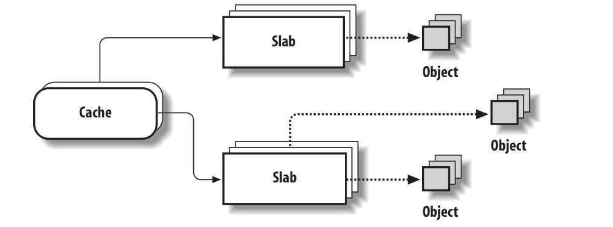

# 前言

本节关注内存区管理，也就是说，关注**具有连续内存地址或任意长度的内存单元序列**

在使用伙伴系统的场景下，如果为了存放很少的字节（比如`malloc(32)`），而分配一整个页框，很显然，这一种很大的浪费。而新的方法则是引入一种新的数据结构来描述如何在同一页框中分配小的内存区域。但这样也引出了一个新的问题，即内存碎片。内存碎片的产生的原因主要是因为**申请的内存**和**分配的内存**不匹配造成的。

# slab分配器
在伙伴系统算法之上运行内存区域分配算法并不是很有效。在sun公司的Solaris 2.4才做系统上首次采用的slab分配器模式派生出了一种更好的算法。它基于以下前提：
- 存储的数据类型可能会影响内存区域的分配方式。比如，当为用户态下的进程分配页框，内核会调用`get_zeroed_page()`函数，将页框初始化为0.slab分配器扩展了这个想法，将内存区域视作由数据结构和一组构造函数和析构函数组成的对象。
    为了避免重复的初始化对象，slab分配器不会丢弃已经分配然后释放的对象，而是将他们保存在内存中。当以后又要请求新的对象时，就可以从内存中获取而不用重新初始化。
- 内核函数倾向于反复请求相同类型的内存区域。比如内核创建一个进程，就要为一些固定大小的表（比如进程描述符，打开的文件对象等）分配内存。当进程被销毁，可以重用这些表包含的内存区域。因为进程的创建和销毁非常的频繁。如果没有slab分配器，内核会浪费时间重复分配和释放包含相同内存区域的页帧;slab分配器允许将它们保存在缓存中并快速重用

    slab分配器将对象分组放到缓存中，每个缓存存储相同类型的对象。例如，当一个文件被打开，存放相应的"打开文件"所需的内存区，是从一个名字叫`file`（文件指针）的slab高速缓存得到的
    包含主存中包含缓存的区域被划分为多个slab，每个slab包含一个或者多个连续页框。这些页框包含已被分配的和空闲的对象
    
