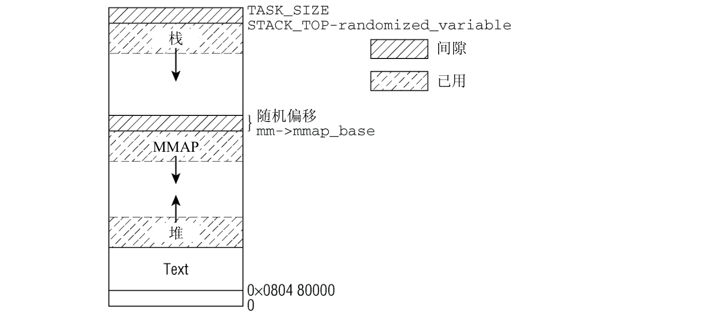

# 进程虚拟地址空间

- 各个进程的虚拟地址空间起始于地址0， 延伸到`TASK_SIZE - 1`，其上半部分是内核地址空间。在32位系统上的四肢空间通常是4G，总的地址空间通常按3:1的比例划分。用户空间分配3G，内核分配1G
- 用户程序只能访问地址空间的下半部分，不能访问**内核**部分。如果没有预先达成"协议"，用户进程也不可能操作另一个进程的地址空间，因为后者的地址空间对前者的地址空间不可见
- 虚拟地址空间由许多不同的段组成，用于不同的目的

## 内存描述符

与进程相关的地址的全部信息都包含在一个叫内存描述符的数据结构中。
```c
struct mm_struct {
	struct vm_area_struct *mmap;		/* 指向线性区间对象的链表头 */
	struct rb_root mm_rb;              /* 指向线性区间对象的红黑树的根 */
    struct vm_area_struct * mmap_cache;	/* 指向最后一个引用的线性对象 */
	unsigned long (*get_unmapped_area) (struct file *filp,
				unsigned long addr, unsigned long len,
				unsigned long pgoff, unsigned long flags);  /* 在进程地址空间中搜索有效线性地址区间的方法 */
	void (*unmap_area) (struct mm_struct *mm, unsigned long addr); /*释放线性区间域时调用的方法  */
	unsigned long mmap_base;		/* 表示第一个分配的匿名线性区间或文件映射的线性地址(mmap区的基地址) */
	unsigned long task_size;		/* 虚拟空间的大小 */
	unsigned long cached_hole_size; 	/* if non-zero, the largest hole below free_area_cache */
	unsigned long free_area_cache;		/* 内核从这个地址开始搜索进程地址空间中线性地址的空闲区域 空闲区域大于等于 cached_hole_size */
	pgd_t * pgd;  /* 全局页目录 */
	atomic_t mm_users;			/* 次使用计数 */
	atomic_t mm_count;			/* 主使用计数 */
	int map_count;				/* 线性区间的个数 */
	struct rw_semaphore mmap_sem; /* 线性区间读写信号量*/
	spinlock_t page_table_lock;		/* 页表和计数自旋锁 */

	struct list_head mmlist;		/* 内存描述符的内嵌链表节点 指向相邻的内存描述符 */

	unsigned long total_vm, locked_vm, shared_vm, exec_vm; /* 进程地址空间的大小 页数；锁住而不能换出的页数；共享文件内存映射的页数；可执行内存映射的页数*/
	unsigned long stack_vm, reserved_vm, def_flags, nr_ptes; /* 用户态栈区的页数；保留区或者在特殊线性区间的页数；线性区间默认的访问标志；进程的页表数 */
	unsigned long start_code, end_code, /* 可执行代码的起始地址；可执行代码的结束地址  代码段 */
    unsigned long start_data, end_data; /* 数据的起始地址；数据的结束地址 数据段*/
	unsigned long start_brk, brk, start_stack; /* 堆的起始地址；当前堆的最后地址 堆区； 用户态栈的起始地址 */ 
	unsigned long arg_start, arg_end, env_start, env_end; /* 命令行参数的起始地址；命令行参数的结束地址 环境变量的起始地址；环境变量的结束地址 */

	unsigned long saved_auxv[AT_VECTOR_SIZE]; /* 在开始执行elf时使用 */

	cpumask_t cpu_vm_mask; /* 用于懒惰TLB交换的掩码 */

	mm_context_t context; /* 指向特定体系结构的信息的表 */

	unsigned int faultstamp;
	unsigned int token_priority;
	unsigned int last_interval;

	unsigned long flags; /* Must use atomic bitops to access the bits */

	/* 核心转储相关 */
	int core_waiters;
	struct completion *core_startup_done, core_done;

	/* aio bits */
	rwlock_t		ioctx_list_lock; // 用于保护 异步io上下文的锁
	struct kioctx		*ioctx_list;  /* 异步io上下文链表 */
};
```


所有的`mm_struct`存放在一个双向链表中。链表的第一个节点是`init_mem`的`mm_list`字段，`init_mm`是初始化阶段`进程0`所使用的内存描述符。

`mm_users`字段存放共享`mm_struct`数据结构的轻量级进程(线程)的个数。`mm_count`字段是内存描述符使用的主计数器，在`mm_users`计数器中的所有用户在`mm_count`中只作为一个单位。每当`mm_count`递减时，就检查`mm_count`是否为0，如果是就接触这个内存描述符。

如果向确保内存描述符在一个长操作的中间不被释放，那么，就应该增加`mm_users`字段而不是`mm_count`字段的值。（这正是函数`try_to_unuse()`）所做的事。


## 进程空间布局


如果计算机提供了巨大的虚拟地址空间，那么使用上述的地址空间布局会工作得非常好。但在32位计算机上可能会出现问题。考虑`IA-32`的情况：虚拟地址空间从`0`到`0xC0000000`，每个用户进程有`3GB`可用。`TASK_UNMAPPED_BASE`起始于`0x4000000`，即`1GB`处。糟糕的是，这意味着堆只有`1GB`空间可供使用，继续增长则会进入到`mmap`区域，这显然不是我们想要的。问题在于，内存映射区域位于虚拟地址空间的中间。这也是在内核版本2.6.7开发期间为IA-32计算机引入一个新的虚拟地址空间布局的原因（经典布局仍然可以使用）



其想法在于使用固定值限制栈的最大长度。由于栈时有界的，因此安置内存映射的区域可以在栈末端的下方立即开始。与经典方法相反，该`mmap`区域现在是自顶向下拓展。由于堆任然位于虚拟地址空间中较低的区域并向上增长，因此`mmap`区域和堆区可以相对拓展，直至好景虚拟地址空间中的剩余区域。为确保栈与`mmap`区域不发生冲突，两者之间设置了一个安全隙