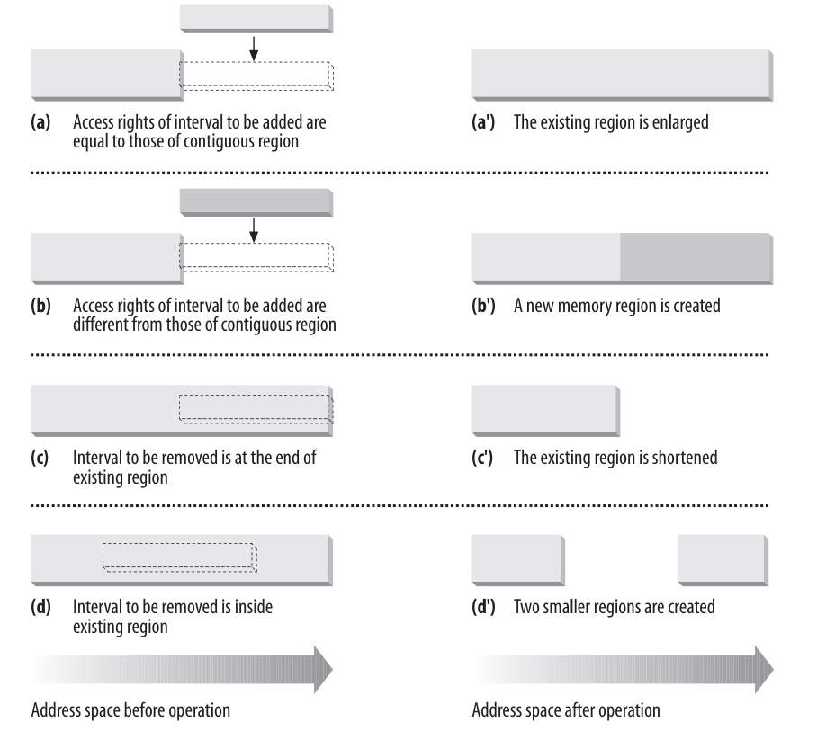

# 线性区间

## 概述

进程地址空间中，我们常见的`代码段，数据段，bss段`等，实际上都是一段地址空间区域（虚拟内存区域）。`Linux`将地址空间中的区域称为`Virtual Memory Area`， 简称`VMA`，使用`struct vm_area_struct`来描述。

`struct vm_area_struct`的描述如下
```c
struct vm_area_struct {
	struct mm_struct * vm_mm;	/* 指向当前VMA所在的内存描述符 */
	unsigned long vm_start;		/* 起始地址. */
	unsigned long vm_end;		/* 结束地址*/

	struct vm_area_struct *vm_next;  /* 按起始地址排序的链表的下一个节点 */

	pgprot_t vm_page_prot;		/* 该VMA的访问权限 */
	unsigned long vm_flags;		/* VMA的标志 */

	struct rb_node vm_rb;  /* 红黑树节点 */ 

	union {
		struct {
			struct list_head list;
			void *parent;	/* aligns with prio_tree_node parent */
			struct vm_area_struct *head;
		} vm_set;
		struct raw_prio_tree_node prio_tree_node;
	} shared; /* 链接到反映射的数据结构 */

	/* 反向映射相关 */
	struct list_head anon_vma_node;	/* Serialized by anon_vma->lock */
	struct anon_vma *anon_vma;	/* Serialized by page_table_lock */

	struct vm_operations_struct * vm_ops; /* 用于处理该结构的函数指针 */

	/* Information about our backing store: */
	unsigned long vm_pgoff;		/* 在映射文件中的偏移量 */
	struct file * vm_file;		/* 指向映射文件的文件对象. */
	void * vm_private_data;		/* 指向VMA的私有数据 一般不使用*/
	unsigned long vm_truncate_count;/* truncate_count or restart_addr */

};

struct vm_operations_struct {
	void (*open)(struct vm_area_struct * area);
	void (*close)(struct vm_area_struct * area);
	int (*fault)(struct vm_area_struct *vma, struct vm_fault *vmf);
	struct page * (*nopage)(struct vm_area_struct * area, unsigned long address, int *type);
};

//在创建和删除区域时，分别调用open和close。这两个接口通常不使用，设置为NULL指针。
//但fault是非常重要的。如果地址空间中的某个虚拟内存页不在物理内存中，自动触发的缺页异常处理程序会调用该函数，将对应的数据读取到一个映射在用户地址空间的物理内存页中。
// nopage是内核原来用于响应缺页异常的方法，不如fault那么灵活。出于兼容性的考虑，该成员仍然保留，但不应该用于新的代码
```

- 每个VMA描述符(struct vm_area_struct)表示一个线性地址区间。
- 进程所拥有的线性区间从来不重叠，并且内核经历吧新分配的线性区与紧邻的现有线性区间进行合并。如果两个相邻的访问权限能够匹配，就能将他们合并在一起。

如图所示，当一个新的线性区间加入到进程的地址空间时，内核检查一个已经存在的线性区是否可以扩大(a)。如果不能，就创建一个新的线性区(b)。如果从进程地址空间删除一个线性区间，内核就要调整受影响的线性区的大小(c)。调整大小迫使一个线性区被分成两个更小的部分。



## 线性区间数据结构

进程的各个区间按两种方式排序
(1) 在一个单链表上(开始于mm_struct->mmap)
(2) 在一个红黑树中，根节点位于mm_rb

